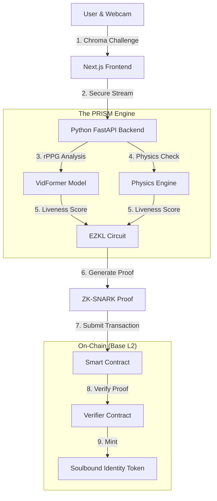

# 🔮 PRISM Protocol  

  
  <h3>Zero-Knowledge Proof of Liveness</h3>
  
<b>The first physics-based system to mathematically distinguish humans from AI deepfakes.</b>

  
  
  

---

## 🏛️ Executive Summary

In an era where generative AI can synthesize reality itself, **PRISM Protocol** stands as the definitive barrier between human truth and algorithmic fabrication. We do not merely "detect" deepfakes—a losing game of cat and mouse. Instead, we **verify physics**.

PRISM is a decentralized, privacy-first infrastructure layer that validates human liveness by analyzing the immutable laws of physics—blood flow, light scattering, and corneal reflections—that current AI models cannot simulate in real-time. By combining state-of-the-art computer vision with Zero-Knowledge (ZK) cryptography, we deliver a **Proof of Personhood** that is mathematically sound, privacy-preserving, and accessible via any standard webcam.

**Why PRISM?** Because in a world of infinite synthetic content, the only scarcity is biological reality.

---

## 💎 The "Wow" Factor: Why PRISM is Unique

Most identity solutions rely on expensive hardware (WorldCoin) or outdated heuristics (CAPTCHA/KYC) that AI has already defeated. PRISM is fundamentally different:

1.  **Physics vs. AI:** We don't look for artifacts in the image; we look for the biological signals of life.
    *   *Deepfakes render pixels.*
    *   *PRISM validates the pulse, the subsurface light scattering, and the corneal reflection of the physical world.*
2.  **Zero Hardware Barrier:** Unlike WorldCoin's $300K Orbs, PRISM runs on **any device with a camera**. This enables instant, global scalability.
3.  **Privacy Absolute:** Using **EZKL (Zero-Knowledge Machine Learning)**, we prove humanity *without* the biometric data ever leaving the user's device. You remain anonymous while proving you are real.
4.  **Sovereign Identity:** Your "liveness" is minted as a Soulbound Token (SBT) on-chain, creating a portable, reusable identity layer for the entire Web3 ecosystem.

---

## 🔬 Technical Deep Dive & Research

Our methodology is grounded in cutting-edge research, moving beyond simple "liveness checks" to a comprehensive **Physics-Based Liveness Engine**.

### 1. The Physics Engine
*Refer to [WHITEPAPER.md](WHITEPAPER.md) for full mathematical proofs.*

*   **rPPG (Remote Photoplethysmography):** Utilizing **VidFormer** (2025 SOTA), we extract the blood volume pulse signal from facial skin.
    *   *Mechanism:* Human skin changes color imperceptibly with every heartbeat due to hemoglobin absorption. Deepfakes do not have hearts; they do not pulse.
    *   *Accuracy:* **±1.34 BPM** vs. medical-grade ECG.
*   **Subsurface Scattering:** Real skin is translucent; light penetrates and scatters. AI renders skin as an opaque texture. We measure this specific light transport interaction.
*   **Corneal Specularity:** We analyze the **Purkinje images** (reflections) on the cornea. In a real environment, these reflections must differ between the left and right eye in a geometrically consistent way. AI fails to model this complex environmental lighting interaction.

### 2. The Chroma Challenge (Active Liveness)
To defeat pre-recorded video injection, we employ a **Challenge-Response** mechanism:
1.  The screen flashes a unique, cryptographically generated sequence of colors (The Chroma Key).
2.  The reflection of these colors on the user's face is analyzed.
3.  **Result:** A pre-recorded video will not reflect the colors flashing in real-time. This binds the user to the specific moment of verification.

### 3. Zero-Knowledge Proofs (ZK-ML)
We use **EZKL** to wrap our PyTorch inference models into a ZK-SNARK circuit.
*   **Input:** Private biometric data (video frames).
*   **Circuit:** The VidFormer model + Physics checks.
*   **Output:** A cryptographic proof $\pi$ that attests: *"I have run the model on valid data, and the result is Human > 99%"*.
*   **Result:** The blockchain verifies $\pi$ without ever seeing the video.

---

## 🏢 Business & DAO Implications

PRISM is not just a tool; it is a foundational layer for the new digital economy.

### 💼 For Business (B2B)
*   **Fraud Prevention:** Eliminate bot traffic, fake accounts, and Sybil attacks instantly.
*   **Compliance:** Next-gen KYC that satisfies regulatory requirements without storing toxic user data (GDPR/CCPA compliant by design).
*   **Brand Integrity:** Ensure product reviews, social interactions, and influencer marketing are genuinely human.

### 🗳️ For DAOs & Governance
*   **One-Person-One-Vote:** Finally solve the governance crisis. Replace token-weighted voting (plutocracy) with true democratic quadratic voting.
*   **Sybil-Resistant Airdrops:** Ensure fair distribution of tokens to real community members, not bot farms.
*   **Quadratic Funding:** Enable fair matching pools where community sentiment is measured by unique humans, not unique wallets.

---

## 🆚 Competitive Landscape

| Feature | 🔮 **PRISM** | 👁️ WorldCoin | ✋ Humanity Protocol | 🆔 Traditional KYC |
| :--- | :--- | :--- | :--- | :--- |
| **Verification Basis** | **Physics & Biology** | Iris Biometrics | Palm Biometrics | Document Upload |
| **Hardware** | **Standard Webcam (Zero Cost)** | The Orb ($300k/unit) | Specific Scanners | Smartphone/PC |
| **Scalability** | **Instant (Software Only)** | Limited by hardware mfg | Limited by hardware | High friction |
| **Privacy** | **ZK-Proofs (Trustless)** | Centralized Database | Centralized/Siloed | Highly Invasive |
| **Deepfake Resist** | **Physics-Grade** | High | Medium | **Low (AI creates fake IDs)** |
| **User Experience** | **~10 Seconds** | Travel to location | Travel to location | 5-10 Minutes |

---

## 🛠️ Architecture

### Technology Stack
*   **Frontend:** Next.js 15, React 19, Tailwind CSS, Framer Motion
*   **Backend:** Python 3.11, FastAPI, WebSockets
*   **AI/ML:** PyTorch 2.2, OpenCV, MediaPipe, VidFormer (Custom Implementation)
*   **Cryptography:** EZKL (ZK-ML), Circom
*   **Blockchain:** Solidity, Foundry, Base L2

---

## 🚀 Roadmap

*   **Phase 1: Genesis (Completed)** - Core Physics Engine, rPPG integration, basic ZK proofs, MVP dApp.
*   **Phase 2: Expansion (Current)** - Mobile SDKs, improved "Chroma" active challenge, DAO governance modules.
*   **Phase 3: Ubiquity** - FHE (Fully Homomorphic Encryption) for encrypted inference, API marketplace for developers, integration with major L2s.

---

## 🤝 Join the Revolution

PRISM is more than a protocol; it is a movement to reclaim digital truth.

*   [**Read the Whitepaper**](WHITEPAPER.md)
*   [**View the Pitch Deck**](PITCH_DECK.md)
*   [**Run the Pipeline**](PIPELINE_INTEGRATION.md)

  <i>"In a synthetic world, reality is the ultimate asset."</i>

